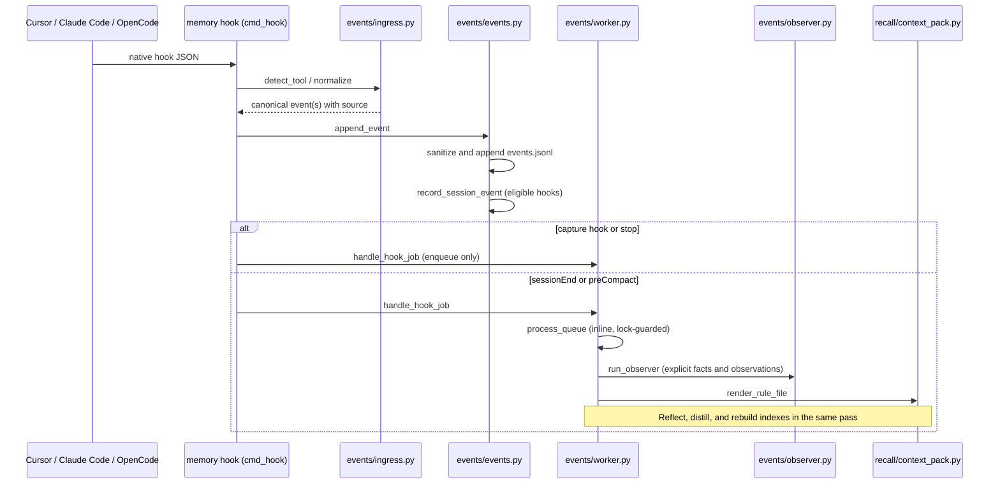
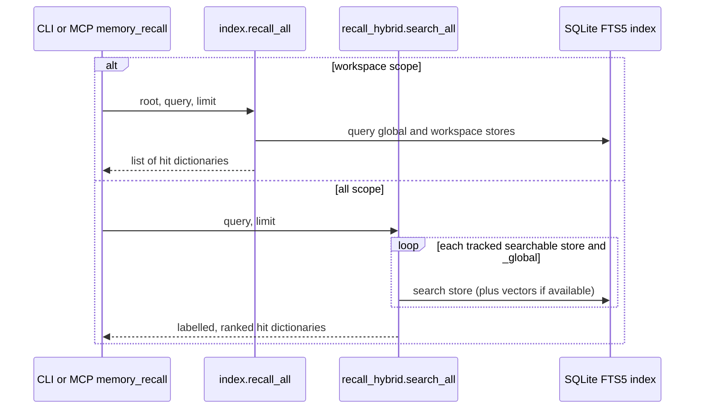

# silly-memory Architecture

## Overview

silly-memory (version 1.0.0 in `VERSION`) is a local memory engine for Cursor, Claude Code, and OpenCode v2. All three use the same project store under the memory home, not separate copies per tool. The Python package is `memory_system`, the CLI is `memory`, the zsh helpers are `mem*`, and the shared rule and skills live in `cursor-extras/`. The engine uses the standard library first: SQLite FTS5 indexes bank files and observations; optional NumPy vectors and embedding backends support hybrid ranking. There is no FAISS store.

`system/config.py` selects the home in this order: `SILLY_MEMORY_HOME`, an installed engine directory with `VERSION`, then `~/.silly-memory`. `paths.py` resolves the workspace root (nearest `.git`, otherwise a memory marker, otherwise the given path) and maps it to one store. `.silly-memory/memory-id` is the project marker. Global memory lives in `_global` under the same home.

The three integrations send hooks to `memory/bin/memory` (`memory hook --tool cursor|claude-code|opencode`). Cursor uses `cursor-extras/hooks/memory-hook.sh`; Claude Code uses `claude-code-extras/hooks/silly-memory-hook.sh`. `opencode-extras/plugins/silly-memory.js` is the OpenCode v2 plugin (a literal `{ id, setup }` export matching `Plugin.define`'s shape); it calls `memory hook --tool opencode` and injects the stored pack before model calls. `events/ingress.py` provides `detect_tool`, `normalize`, and `format_output`. Normalized events use Cursor's canonical names—`sessionStart`, `beforeSubmitPrompt`, `afterAgentResponse`, `afterFileEdit`, `afterShellExecution`, `preCompact`, `sessionEnd`, `stop`—and carry a `source` (`cursor`, `claude-code`, or `opencode`). One native hook can produce more than one event (Claude Code `Stop` can produce a response followed by `stop`).

## Directory Map

This is the Python tree under `memory/lib/memory_system/`; `__init__.py` files mark package boundaries. Every module is imported by its full path (for example `memory_system.system.config`). Descriptions are deliberately short; not every module is on the hook path.

```text
memory/lib/memory_system/
├── __init__.py                      package marker (no side effects)
├── index.py                         SQLite FTS5 index, rebuild and recall
├── paths.py                         workspace identity and store/rule paths
├── safety.py                        file locks and atomic writes
├── scope.py                         merge global/workspace context sources
├── privacy.py                       network-access gate
├── redact.py                        secret, private-span and path redaction
├── preflight.py                     FTS5 and filesystem checks
├── mcp_server.py                    stdio MCP protocol and tool dispatch
├── project_mcp.py                   the server entry in each project's tool config
├── adapters/
│   ├── __init__.py, base.py          adapter exports and work-state selection
│   ├── coding.py                    git-based work-state snapshot
│   └── management.py                focus/actions work-state snapshot
├── backends/
│   ├── __init__.py, factory.py       backend selection
│   ├── embedding/
│   │   ├── __init__.py, base.py       embedding interface
│   │   ├── fastembed_backend.py      FastEmbed implementation
│   │   ├── noop_backend.py           no-embedding fallback
│   │   ├── sentence_transformers_backend.py  sentence-transformers implementation
│   │   └── weights_manifest.py      model weight verification
│   └── llm/
│       ├── __init__.py, base.py       LLM interface
│       ├── cursor_agent_backend.py   Cursor Agent implementation
│       └── noop_backend.py           no-LLM fallback
├── cli/
│   ├── __init__.py                   CLI package
│   ├── cli_delete.py                 entry deletion and prune review
│   ├── cli_inspect.py                entry and ranking inspection
│   ├── cli_learn_status.py           learning telemetry
│   └── doctor.py                     ordered read-only health checks
├── eval/
│   ├── __init__.py                   evaluation package
│   └── recall_baseline.py           recall-quality baseline
├── events/
│   ├── __init__.py                   event exports
│   ├── ingress.py                    native hook normalization
│   ├── events.py                     sanitized JSONL log and job queue
│   ├── observer.py                   logged events to observations/facts
│   └── worker.py                     lock-guarded inline queue processing
├── learning/
│   ├── __init__.py                   learning package
│   ├── active_questioning.py        question suggestions
│   ├── ai_text_log.py               assistant-response log
│   ├── classifier.py                fact category classifier
│   ├── contradiction.py             conflicting-bank-entry detection
│   ├── correction_detector.py       user-correction detection
│   ├── explicit.py                  direct and prompted fact storage
│   ├── reinforcement.py             score changes from corrections
│   └── topic.py                     tag-based topic grouping
├── lifecycle/
│   ├── __init__.py                   lifecycle package
│   ├── backup.py                     store snapshots and restore
│   ├── compaction.py                duplicate-entry proposals
│   ├── decay.py                     score decay
│   ├── export_bundle.py             portable store export/import
│   └── scoring.py                   bank-entry score sidecars
├── recall/
│   ├── __init__.py                   recall package
│   ├── context_pack.py              stored pack and project rules
│   ├── context_pack_v2.py           alternate topic/score-based pack builder
│   ├── distiller.py                 observations to durable bank entries
│   ├── handoff.py                   one-use compaction notes
│   ├── recall_hybrid.py             FTS5/vector/score ranking; all-store search
│   └── sessions.py                  recent conversation timeline
├── reflection/
│   ├── __init__.py                   reflection package
│   ├── reflector.py                 observation condensation
│   └── reflector_v2.py              archive-and-condense variant
├── status/
│   ├── __init__.py                   status exports
│   ├── banner.py                     dashboard and first-run/upgrade banners
│   ├── doctor_cache.py              cached integrity summary for banner
│   ├── main.py                      workspace, task and file-path views
│   └── markers.py                   first-run/upgrade marker files
├── storage/
│   ├── __init__.py                   storage package
│   ├── observations_archive.py      monthly observation archives
│   └── vector_store.py              optional NumPy vectors and ID sidecar
└── system/
    ├── __init__.py                   system package
    ├── config.py                     home selection and config loading
    ├── install_transaction.py       owned artifacts/fragments and journal revert
    ├── normalize.py                 text normalization
    ├── profile.py                   profile-to-global-bank sync
    ├── uninstall_transaction.py     planned removal of installer-owned wiring
    ├── upgrade_transaction.py       in-place upgrade, backup and recovery
    └── version.py                   VERSION parsing and comparison
```

## Public API Quick Reference

These are **actual entry points**, not a promise that every internal symbol is a stable library API. CLI commands live in `memory/bin/memory`; `memory/bin/memory-mcp` launches `mcp_server.main`.

| Symbol | Defined in | Role |
| --- | --- | --- |
| `cmd_hook` | `memory/bin/memory` | Read hook JSON on stdin and dispatch canonical events. |
| `cmd_add`, `cmd_recall`, `cmd_tasks` | `memory/bin/memory` | The commands the memory skills run; the CLI twins of the three MCP tools. |
| `detect_tool`, `normalize`, `format_output` | `events/ingress.py` | Detect, translate and answer tool hooks. |
| `append_event`, `enqueue_job` | `events/events.py` | Log sanitized events and queue work. |
| `record_session_event` | `recall/sessions.py` | Maintain the per-conversation recent-session timeline. |
| `handle_hook_job`, `process_queue` | `events/worker.py` | Queue capture; run heavy passes inline at boundaries. |
| `run_observer` | `events/observer.py` | Consume logged events and persist observations/explicit prompts. |
| `extract_explicit_fact`, `store_explicit_fact` | `learning/explicit.py` | Parse “remember that …” and save a sanitized bank fact. |
| `merge_context_sources` | `scope.py` | Combine global bank, project bank, work state, sessions and observations. |
| `render_rule_file`, `session_start_top_up` | `recall/context_pack.py` | Refresh stored pack/rules; restore compaction context. |
| `write_handoff`, `consume_handoff` | `recall/handoff.py` | Persist and consume a conversation-specific note. |
| `rebuild_index`, `recall_all` | `index.py` | Rebuild FTS5; query this workspace plus global. |
| `hybrid_recall`, `search_all` | `recall/recall_hybrid.py` | Return ranked dictionaries; search all tracked stores respectively. |
| `McpServer`, `main` | `mcp_server.py` | MCP workspace binding, tools and stdio loop. |
| `mcp_enabled`, `ensure_project_mcp`, `remove_project_mcp` | `project_mcp.py` | The `"mcp"` setting; add or remove the server in a project's own config. |
| `resolve_workspace_root`, `workspace_store` | `paths.py` | Pick repository root and its shared store. |
| `memory_home` | `system/config.py` | Select memory home with env/installed/default precedence. |
| `render_status` | `status/banner.py` | Text status dashboard and applicable banners. |
| `run_doctor` | `cli/doctor.py` | Run ordered diagnostic checks. |

## Sequence Diagrams

### Hook to context pack

`append_event` uses `redact.sanitize_payload` (including `<private>…</private>` stripping) and writes `events.jsonl` unless the path is suppressed. It also calls `record_session_event` for eligible session hooks. Ordinary capture hooks queue `observe`; `stop` queues a job but does not run the heavy pass. `sessionEnd` and `preCompact` run `process_queue` inline under a non-blocking worker lock: observe, reflect, distill, render, rebuild indexes. This is **not** a detached background process or an editor-event subscriber. The observer reads the event log; it extracts “remember that …” facts before the passive observation threshold and stores them through `store_explicit_fact`.



`scope.merge_context_sources` builds `context-pack.md` from global and workspace bank files, then the current work state, **## Recent sessions** (when present), and recent observations. `render_rule_file` first refreshes the stored pack, then writes each configured project's rule: Cursor `.cursor/rules/_memory-context.mdc` and Claude Code `.claude/rules/_memory-context.md`. OpenCode has no project rule; its plugin reads and injects `context-pack.md`. A successful MCP `memory_add` also refreshes that workspace's configured targets. At `preCompact`, a completed worker pass writes a conversation-specific note with `write_handoff`; `session_start_top_up` calls `consume_handoff` on a matching compact start. OpenCode requires a matching handoff token. On other starts it returns a short refresh hint.

### Recall path

The CLI's normal `memory recall` and MCP `memory_recall` with `scope: "workspace"` call `index.recall_all(root, query, limit)`: FTS5 results from this workspace and `_global`. `--all` / `scope: "all"` call `recall_hybrid.search_all(query, limit)`, which visits **every tracked searchable store** and `_global`, labels results by workspace, ranks and then limits the combined output. Empty stores have nothing to search; an unreadable searchable store raises an error rather than silently disappearing. No recency or performance-diagnostic threshold excludes stores. `hybrid_recall(store, query, backend=..., limit=...)` is a separate per-store ranker returning a list of dictionaries; it combines FTS5, optional NumPy-vector similarity and score sidecars, falling back to FTS5 when embeddings are unavailable.



### Memory tools, MCP, and health

The agent reaches memory through skills by default. `query-memory` and `add-memory` run `memory recall`, `memory tasks`, and `memory add`; `cmd_add` calls the same `store_explicit_fact` and `render_rule_file` as the MCP tool `memory_add`. Every CLI command that takes `--workspace` goes through `paths.resolve_workspace_root`, so the commands, the hooks, and the MCP server agree on a project's store.

`memory/bin/memory-mcp` runs `mcp_server.py` as line-delimited JSON-RPC 2.0 over stdio (protocol `2025-06-18`). It exposes exactly `memory_recall`, `memory_tasks`, and `memory_add`. `McpServer.workspace` binds each client through `paths.resolve_workspace_root`: Cursor negotiates `roots/list` (or uses an explicit override), Claude Code uses `CLAUDE_PROJECT_DIR`, and OpenCode and a standalone invocation use the directory the server was started in. The server is off unless `config.json` has `"mcp": true` (`./install.sh --mcp`; read by `project_mcp.mcp_enabled`). Registration is per project, never global: while it is on, at session start `bin/memory` calls `project_mcp.ensure_project_mcp`, which adds the server to the wired tools' project files (`.mcp.json` with Claude's approval in `.claude/settings.local.json`, `.cursor/mcp.json`, `opencode.json`). The entries carry no machine path; `sh` finds the memory home when the server starts. `project_mcp.remove_project_mcp` takes them out again for uninstall and when `install.sh` turns the server off. `memory_add` uses `store_explicit_fact` (`auto`, `workspace`, or `global` scope) and then `render_rule_file`; if the write succeeds but the refresh fails, the result reports that the rules will refresh at a later boundary. `memory_tasks` uses `status/main.py` task rendering.

`memory status` uses `status/banner.py` for a workspace dashboard, with first-run/upgrade markers from `status/markers.py` and cached integrity information from `status/doctor_cache.py`. `memory doctor` runs `cli/doctor.py`'s `CHECKS`: `home_writable`, `sqlite_integrity`, `version_marker`, `embedding_weights`, `privacy_invariant`, `tools`, `mcp`, `recall_p95`, `stale_locks`, `backup_retention`. The synthetic recall timing check is a diagnostic in an isolated temporary home; it does not filter recall stores.

## No-Go Zones Index

Read [`docs/no-go-zones.md`](no-go-zones.md) before changing locked-down modules. In particular, treat file-lock/atomic-write behavior, SQLite schema and FTS5 triggers, redaction, privacy gating and backend loading as compatibility boundaries. That document describes an earlier modularization freeze; do not use its old FAISS/API descriptions as the runtime architecture.

Installer work is separate from the engine data path: `system/install_transaction.py` records owned files and shared-configuration fragments, journals intended/applied changes, can revert owned before-images, and provides `run-locked`. `system/upgrade_transaction.py` upgrades the home in place, makes numbered verified backups with a `.upgrade-transaction/` state and journal, and recovers interrupted changes. `system/uninstall_transaction.py` plans removal first and preserves files not recognized as installer-owned. See the README for operational commands.

## Contributing

Start with [`memory/lib/memory_system/CONTRIBUTING.md`](../memory/lib/memory_system/CONTRIBUTING.md) for change recipes and test pointers. Some of its older architectural descriptions predate the current three-tool ingress; use the source and this map for current behavior.

## Where to Add a New Feature

| Change | Start here | Check before merging |
| --- | --- | --- |
| Tool hook mapping | `events/ingress.py`, integration shim/plugin, `memory/bin/memory` | Keep canonical event names, source, and reply format. |
| Event capture or queue job | `events/events.py`, `events/worker.py` | Preserve sanitization, suppression and short hook latency. |
| Explicit fact or observation logic | `learning/explicit.py`, `events/observer.py` | Keep private text out of bank and event-derived content. |
| Rule/context output | `scope.py`, `recall/context_pack.py`, `paths.py` | Refresh both configured rules and the stored OpenCode pack. |
| Search and ranking | `index.py`, `recall/recall_hybrid.py`, `storage/vector_store.py` | Distinguish current workspace + global from exhaustive all-store search. |
| MCP tool or binding | `mcp_server.py`, `memory/bin/memory-mcp` | Keep stdio output valid and resolve client workspaces. |
| Install, upgrade or removal | `system/install_transaction.py`, `system/upgrade_transaction.py`, `system/uninstall_transaction.py` | Respect ownership, journals and recovery. |
| Status or health check | `status/banner.py`, `status/main.py`, `cli/doctor.py` | Keep diagnostics separate from recall scope. |
